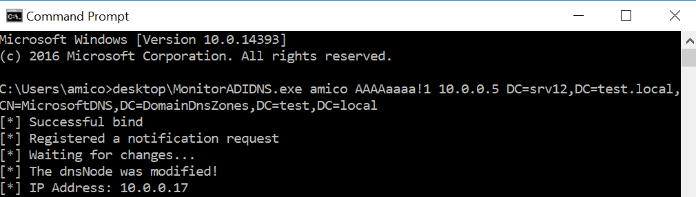

# MonitorADIDNS

This tool submits LDAP notification requests to a DC in order to monitor a target dnsNode object, it then waits for object changes and for each one it checks if an A record was created in the node.
It's a simple example of how to monitor possible targets for the attack I dubbed [ADIDNS Time Bombs](https://medium.com/@offsecdeer/adidns-time-bombs-poison-today-relay-tomorrow-c224934eefa6), with which an attacker can take control of computers that will be added to the domain at a later date with malicious records of the same name as the target.

The change notification code is taken from here:
- https://web.archive.org/web/20160306072504/http://dunnry.com/blog/ImplementingChangeNotificationsInNET.aspx

Requires installing [System.DirectoryServices.Protocols](https://www.nuget.org/packages/System.DirectoryServices.Protocols/).
